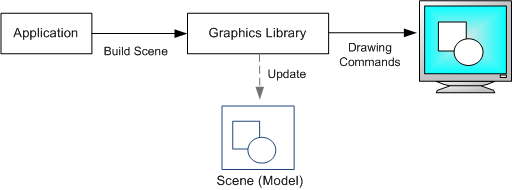

- title : Hink
- description : Write web applications without CSS
- author : Maxime Mangel
- theme : night
- transition : default

***

## Hink

<br />
<br />

### Write web applications without CSS

<br />
<br />
Maxime Mangel - [@mangelmaxime](http://www.twitter.com/mangelmaxime)

***

### Maxime Mangel

* Contributor to Fable ecosystem
* Maintainer of:
    * Elmish templates
    * Fulma projects
    * Hink

***

* Why a new GUI ?
    * Alternative is good
    * Retained mode versus Immediate mode
* Key concepts
    * Immediate mode
    * Auto layout
    * Minimal theming
    * Coherent and clean design

***

## Why Hink ?

* HTML + CSS is not always the solution
* Easier integration for canvas based app
* Experimenting is fun

---

## Why Hink ?

### Retained mode



---

## Why Hink ?

### Immediate mode


***

## Key concepts

---

## Key concepts

### Immediate mode

```fs
    if ui.Button("Click me") then
        console.log("You clicked on the button")
```

---

## Key concepts

### Auto layout

```fs
    ui.Label("Line n°1")
    ui.Label("Line n°2")
    ui.Label("Line n°3")
```

---

## Key concepts

### Auto layout

```fs
    ui.Row([| 1./3.; 1./3.; 1./3. |])
    if ui.Button("Click me") then
        console.log("You clicked on the button")
    ui.Empty()
    ui.Label("Counter value: " + string counterValue)
```

---

## Key concepts

### Key handler & application shortcut

```fs
fun keyboard ->
    match keyboard.Modifiers with
    | { Control = true } ->
        match keyboard.LastKey with
        | Keyboards.Keys.N ->
            Browser.console.log("Create a new ...")
            true
    | _ ->
        match keyboard.LastKey with
        | Keyboard.Keys.Enter ->
            Browser.console.log("Enter pressed")
            true
        | _ -> false
```

---

## Key concepts

### Minimal theming

*Planned*
```fs
    Element =
        { CornerRadius = 4.
          Height = 34.
          SeparatorSize = 2.
          Background =
            { Pressed = Color.rgb 22 160 133
              Hover = Color.rgb 72 201 176
              Default = Color.rgb 26 188 156 } }
```

***

## Demo

***

### Today Hink is:

* 1.000 lines for the *Core*
* 250 + 150 lines for *Inputs abstraction*
* A record of 100 lines for the *Theming*

***


## Goals

* Fast prototype
* Easy integration
* Focus on your app not the design

***

### Next step ?

- Finish window layout
- More widgets
    - Tabs
    - Canvas free
- Rework the theming system
- Focus on user experience

***

### Thank you!

* https://ionide.io
* http://fable.io
* https://github.com/MangelMaxime/Hink
